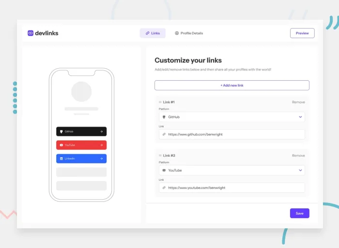

# Frontend Mentor - Link-sharing app solution

This is a solution to the [Link-sharing app challenge on Frontend Mentor](https://www.frontendmentor.io/challenges/linksharing-app-Fbt7yweGsT). 

This project is a Full-stack Link Sharing App for developers, built using React/Typescript, Node.js and MongoDB.
It allows users to create a profile with a photo, name and social links and share it using a generated link.

## Table of contents

- [Frontend Mentor - Link-sharing app solution](#frontend-mentor---link-sharing-app-solution)
  - [Table of contents](#table-of-contents)
  - [Overview](#overview)
    - [The challenge](#the-challenge)
    - [Screenshot](#screenshot)
    - [Links](#links)
  - [My process](#my-process)
    - [Built with](#built-with)
    - [What I learned](#what-i-learned)
    - [Useful resources](#useful-resources)
  - [Author](#author)

## Overview

### The challenge

Users should be able to:

- Create, read, update, delete links and see previews in the mobile mockup
- Receive validations if the links form is submitted without a URL or with the wrong URL pattern for the platform
- Drag and drop links to reorder them
- Add profile details like profile picture, first name, last name, and email
- Receive validations if the profile details form is saved with no first or last name
- Preview their devlinks profile and copy the link to their clipboard
- View the optimal layout for the interface depending on their device's screen size
- See hover and focus states for all interactive elements on the page
- **Bonus**Save details to a database.
- **Bonus**Create an account and log in (added user authentication to the full-stack app)
- **Bonus**Drag and drop image to upload profile picture

### Screenshot

### Links

- [Solution URL](https://www.frontendmentor.io/solutions/link-sharing-app-mern-stack-tailwind-ctF4kYN_pL)
- [Live Site URL](https://link-app-u33e.onrender.com)

## My process

### Built with
Built using MERN Stack with Typescript and TailwindCSS.
- [MongoDB](https://www.mongodb.com/) - Document-oriented database
- [React](https://reactjs.org/) - JS library
- [Typescript](https://www.typescriptlang.org/)
- [TailwindCSS](https://tailwindcss.com/) - A utility-first CSS framework
- [Node.js](https://nodejs.org/en) - JS Runetime Enviroment
- [Express](https://expressjs.com/) -  Back end web application framework

- [MongoDB Atlas](https://www.mongodb.com/cloud/atlas/) - Deploy MongoDB Database
- [Cloudinary](https://cloudinary.com/) - Store Images
- [Render](https://render.com/) - Hosting Fronent and Backend

### What I learned
I learned how to build a full-stack application using the MERN STACK.
 - Implement Authentication & Authorisation
 - Implement React Router with Authication & Authorisation
 - Build Drag&Drop Functionality
 

### Useful resources

- [User Authentication with JWT example](https://www.bezkoder.com/react-express-authentication-jwt/#Front-end_with_React_React_Router) - This showed me how to implement Authentication & Authorisation.
- [React-router Auth Router Provider Example](https://stackblitz.com/github/remix-run/react-router/tree/main/examples/auth-router-provider?file=src%2FApp.tsx) - This is show me how to implement React Router with Authentication.

## Author

- Website - [Mondara](https://mondarathotage.com/)
- Linkedin - [@Mondara](https://www.linkedin.com/in/mondara-thotage/)
- Github - [@Mondara](https://github.com/Mondara)

